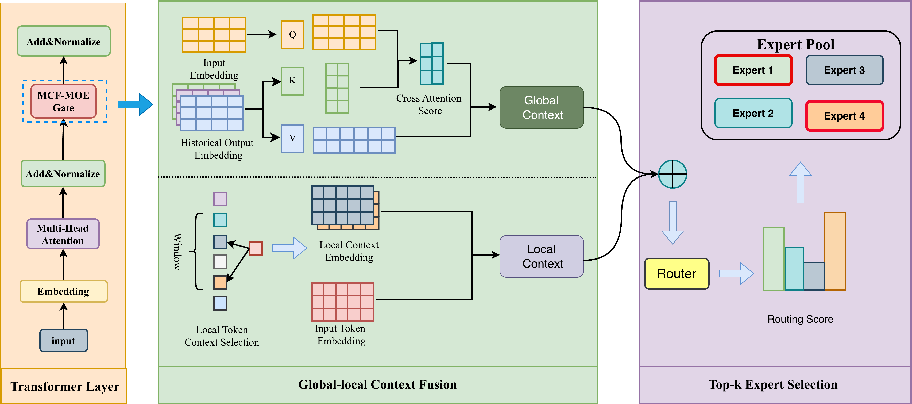

<div align="center">

<h1>MCF-MoE: Multi-level Context Modeling for<br>Consistent Expert Selection in Mixture-of-Experts</h1>

<p>
  <a href="https://anonymous.4open.science/r/MCFMOE"></a>
  
  
  
  <a href="LICENSE"></a>
</p>

<p>
  <a href="#-overview">Overview</a> •
  <a href="#-main-results">Results</a> •
  <a href="#%EF%B8%8F-installation">Installation</a> •
  <a href="#-quick-start">Quick Start</a> •
  <a href="#%EF%B8%8F-repository-structure">Structure</a> •
  <a href="#-citation">Citation</a>
</p>

</div>

---

> **TL;DR** &nbsp; MoE routers usually pick experts from a single, isolated token representation. We show that this *context incompleteness* leads to unstable, semantically inconsistent routing, and propose **MCF-MoE**, a gate that routes on **local token-level context** fused with **global cross-layer context**. MCF-MoE improves language modeling, downstream accuracy and long-context latency over strong MoE routers.

## 📖 Overview

<p align="center">
  
</p>
<p align="center"><em>
Overall workflow of MCF-MoE. <b>Left:</b> a Transformer layer with the MCF-MoE gate. <b>Middle:</b> a local similarity-aware query and global cross-layer keys/values. <b>Right:</b> Top-<i>K</i> expert selection.
</em></p>

Mixture-of-Experts (MoE) scales Transformers by activating only a few experts per token, so how well it works depends heavily on the **router**. Existing routers (SMoE, SMoE-Dropout, HyperRouter, RMoE, …) mainly redesign the gating rule or compress layer-wise activations. They still score experts from *shallow or isolated* token representations, which leads to fragmented expert utilization and unstable specialization.

**MCF-MoE** instead asks *how to build a contextually complete representation for routing*. Its gate combines two complementary sources of evidence:

| Component | What it does |
| :-- | :-- |
| 🔹 **Local Similarity-aware Context Fusion** | For each token, it scores the `r` preceding tokens by dot-product similarity, keeps the Top-`k_loc` neighbours and aggregates them with softmax weights. A residual connection and a projection turn the result into the **query**. |
| 🔸 **Global Cross-layer Context Fusion** | It caches the inputs of the previous `k` layers, adds layer embeddings and projects them into **keys / values**. A position-aligned **causal mask** keeps routing autoregressive. |
| 🔀 **Multi-level Context Fusion for Gating** | Cross-attention between the local query and the cross-layer memory produces a fused context `z`, which is mapped to routing logits for **Top-K** expert selection. |

The routing logits at position *i* depend only on positions ≤ *i*, so training-time routing is identical to routing under incremental decoding.

## ✨ Highlights

- **A new view of routing.** We recast inconsistent expert specialization as a *routing-context* problem rather than a gating-rule problem.
- **Plug-and-play gate.** MCF-MoE only replaces the router. The experts and the backbone are left untouched, and the gate works with Transformer-XL and DeepSeek-MoE backbones.
- **Better and cheaper.** Transformer-XL with MCF-MoE (0.035B parameters) beats the dense model (0.054B). MCF-MoE also has the **lowest latency** among the compared methods from 1k to 4k tokens.
- **Structured expert collaboration.** The gate forms semantically coherent expert groups while keeping clear specialization across groups.

## 📊 Main Results

<details open>
<summary><b>Pre-training</b> (lower is better)</summary>

| Method | Backbone | Enwik8 (bpc ↓) | WikiText-103 (ppl ↓) | Params (B) |
| :-- | :-: | :-: | :-: | :-: |
| Dense | Transformer-XL | 1.166 | 27.361 | 0.054 |
| SMoE | Transformer-XL | 1.307 | 46.956 | 0.032 |
| RMoE | Transformer-XL | 1.293 | 39.491 | 0.042 |
| SMoE-Dropout | Transformer-XL | 1.262 | 39.557 | 0.032 |
| HyperRouter | Transformer-XL | 1.141 | 26.405 | 0.038 |
| **MCF-MoE (Ours)** | Transformer-XL | **1.126** | **25.975** | 0.035 |

| Method | Backbone | C4 (bpc ↓) | Params (B) |
| :-- | :-: | :-: | :-: |
| SMoE | DeepSeek-MoE | 5.294 | 16.376 |
| RMoE | DeepSeek-MoE | 4.283 | 16.444 |
| SMoE-Dropout | DeepSeek-MoE | 3.058 | 16.376 |
| HyperRouter | DeepSeek-MoE | 4.280 | 17.300 |
| **MCF-MoE (Ours)** | DeepSeek-MoE | **1.099** | 16.489 |

</details>

<details open>
<summary><b>Fine-tuning on GLUE</b> (accuracy %, higher is better)</summary>

| Method | SST-2 | QQP | QNLI | RTE | CoLA | WNLI | **Avg** |
| :-- | :-: | :-: | :-: | :-: | :-: | :-: | :-: |
| Dense | 73.61 | 72.25 | 56.63 | 49.26 | 67.02 | 23.44 | 57.04 |
| SMoE | 77.08 | 72.98 | 52.79 | 47.43 | 62.40 | 32.81 | 57.58 |
| RMoE | <u>79.86</u> | <u>74.14</u> | 56.82 | <u>52.21</u> | 61.92 | 20.31 | 57.40 |
| SMoE-Dropout | 76.74 | 73.18 | <u>57.83</u> | 51.10 | 63.46 | 42.19 | <u>60.75</u> |
| HyperRouter | 67.48 | 69.13 | 53.95 | <u>52.21</u> | 61.73 | <u>51.56</u> | 59.34 |
| **MCF-MoE (Ours)** | **80.21** | **74.55** | **61.61** | **54.41** | **69.13** | **56.25** | **66.03** |

Best results are in **bold** and second-best are <u>underlined</u>.

</details>

<details>
<summary><b>Ablation</b> (Enwik8 / WikiText-103, 20k steps)</summary>

| Variant | Enwik8 bpc | Δ | WikiText-103 ppl | Δ |
| :-- | :-: | :-: | :-: | :-: |
| **MCF-MoE (Full)** | **1.184** | – | **27.837** | – |
| w/o Global Context | 1.219 | +0.035 | 28.121 | +0.284 |
| &nbsp;&nbsp;&nbsp;↳ w/o Cross-attention | 1.209 | +0.025 | 28.045 | +0.208 |
| &nbsp;&nbsp;&nbsp;↳ w/o Causal Mask | 1.210 | +0.026 | 28.098 | +0.261 |
| w/o Local Context | 1.205 | +0.032 | 28.533 | +0.696 |
| Standard MoE | 1.347 | +0.163 | 29.085 | +1.248 |

</details>

<details>
<summary><b>Inference efficiency</b> (latency in ms vs. sequence length)</summary>

| Method | 512 | 1k | 2k | 4k |
| :-- | :-: | :-: | :-: | :-: |
| Dense | **373.51** | 2373.18 | 6476.54 | 18670.08 |
| SMoE | 1052.43 | 2272.66 | 5170.95 | <u>16577.62</u> |
| RMoE | 2491.48 | 4983.92 | 8582.39 | 22170.06 |
| SMoE-Dropout | <u>634.05</u> | <u>1569.54</u> | 5114.14 | 17042.39 |
| HyperRouter | 1133.29 | 2273.26 | <u>5072.63</u> | 18744.83 |
| **MCF-MoE (Ours)** | 696.19 | **1080.32** | **4678.29** | **16002.83** |

Peak memory is comparable across all methods (about 0.8 GB at 512 tokens and 3.1–3.2 GB at 4k tokens).

</details>

## 🛠️ Installation

```bash
conda create -n mcfmoe python=3.10 -y
conda activate mcfmoe

pip install -r requirements.txt   # torch==2.7.0, transformers==4.51.3, dm-tree
```

MCF-MoE relies on [FastMoE](https://github.com/laekov/fastmoe) for the expert layers. Install it from source so that it matches your CUDA / PyTorch versions:

```bash
git clone https://github.com/laekov/fastmoe.git
cd fastmoe && USE_NCCL=1 python setup.py install
```

## 📂 Data Preparation

| Stage | Datasets | Metric |
| :-- | :-- | :-- |
| Pre-training | Enwik8, WikiText-103 | bpc / ppl |
| Fine-tuning | SST-2, QQP, QNLI, RTE, CoLA, WNLI | accuracy |

- **Enwik8 / WikiText-103.** Download them with the standard [Transformer-XL `getdata.sh`](https://github.com/kimiyoung/transformer-xl/blob/master/getdata.sh) script.
- **GLUE tasks.** Pre-packed SST-2, QNLI and RTE are provided in [`../data`](../data) (unzip before use). The other tasks can be obtained from [GLUE](https://gluebenchmark.com/tasks).

## 🚀 Quick Start

All scripts are launched from this `code/` directory. Before running, fill in the placeholders at the top of each script (`DATASET_PATH`, `your_dataset_name`, `output_path`, and `pretrained_weight` for fine-tuning).

**1. Pre-train Transformer-XL with MCF-MoE on Enwik8 / WikiText-103**

```bash
bash script/pretrain/pretrain_script.sh
```

**2. Fine-tune on downstream tasks**, starting from a pre-trained checkpoint:

```bash
bash script/finetune/finetune_script.sh
```

<details>
<summary><b>Key arguments</b></summary>

| Argument | Default in scripts | Description |
| :-- | :-: | :-- |
| `--gate_name` | `GlobalRouterGate` | Uses the MCF-MoE gate |
| `--moe-num-expert` / `--moe-top-k` | `16` / `2` | Top-2-of-16 routing |
| `--moe_index` | `0,1,2,3` | Layers that use MoE (4 of 8) |
| `--global_router_k` | `3` | Number of cached historical layers `k` |
| `--global_router_heads` | `8` | Attention heads in the fusion module |
| `--global_router_d_kv` | `64` (pre-train) / `32` (fine-tune) | Key/value dimension `d'` |
| `--load_balance` | `0.01` | Weight of the load-balancing loss |
| `--tgt_len` / `--mem_len` | `512` / `512` | Segment length and memory length |

</details>

## 🗂️ Repository Structure

```text
code/
├── train_global.py            # Pre-training entry (Enwik8 / WikiText-103)
├── train_sst2.py              # Fine-tuning entry (SST-2 / QQP / QNLI / RTE ...)
├── mem_glb_transformer.py     # Transformer-XL backbone with the MCF-MoE gate
├── custom_glb_gate.py         # MCF-MoE gate (GlobalRouterGate): local + global context fusion
├── custom_glb_layers.py       # MoE layers built on the MCF-MoE gate
├── custom_glb_transformer.py
├── gates/                     # Baseline gates (naive, noisy, switch, gshard, hypernetwork, ...)
├── fastermoe/                 # FasterMoE scheduling utilities
├── utils/                     # Adaptive softmax, vocabulary, data parallel, logging
├── data_utils.py              # Corpus / GLUE data loaders
├── script/
│   ├── pretrain/pretrain_script.sh
│   └── finetune/finetune_script.sh
└── assets/overview.png
```

## 📝 Citation

If you find this work useful, please consider citing:

```bibtex
@article{mcfmoe,
  title   = {Multi-level Context Modeling for Consistent Expert Selection in Mixture-of-Experts},
  author  = {Anonymous},
  journal = {Under Review},
  year    = {2026}
}
```

## 🙏 Acknowledgements

This codebase builds on [Transformer-XL](https://github.com/kimiyoung/transformer-xl), [FastMoE](https://github.com/laekov/fastmoe), [SMoE-Dropout](https://github.com/VITA-Group/Random-MoE-as-Dropout), [HyperRouter](https://github.com/giangdip2410/HyperRouter) and [RMoE](https://github.com/qiuzh20/RMoE). We thank the authors for open-sourcing their work.

## 📄 License

This project is released under the [Apache 2.0 License](LICENSE).
